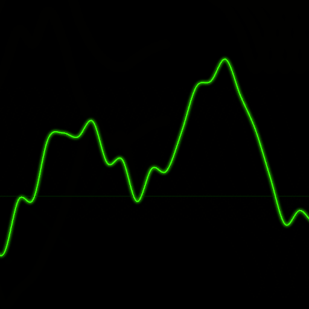

#  Silence

A wave interference puzzle game. Cancel noise by dropping wavelets that destructively interfere with the signal.

## Gameplay

- **Objective**: Reduce the RMS (Root Mean Square) of the noise signal below 0.1 to win
- **Lose condition**: RMS exceeds 5.0 or signal clips above 25
- **Difficulty**: Wavelets become more complex as you reduce the noise (lower RMS = harder wavelets)
- **Controls**:
  - Drag to position wavelets horizontally
  - Tap to drop and merge
  - Invert button to flip wavelets (5 uses per game)

## Technical Details

- Built with vanilla JavaScript and Canvas API
- Uses Catmull-Rom spline interpolation for smooth waveform rendering
- Implements actual wave superposition physics
- Progressive Web App (PWA) - works offline once installed

## Running

Open `index.html` in a web browser. For development with PWA features, serve via a local web server.

## Building

The `get_cache.go` script generates the service worker cache list:

```bash
go run get_cache.go
```

Copy the output to update `CACHE_FILES` in `sw.js` when adding new assets.
